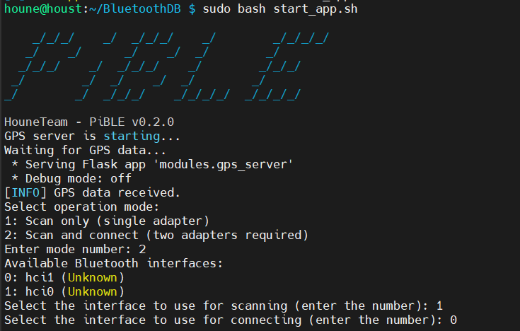

# PiBLE - Bluetooth и GPS сканер



## Описание

**PiBLE** - это проект, предназначенный для сканирования Bluetooth устройств и интеграции данных GPS в базу данных. Он использует библиотеку **bleak** для взаимодействия с Bluetooth Low Energy (BLE) и **Flask** для управления данными GPS.

## Основные возможности

- **Сканирование Bluetooth устройств:**
  - Обнаружение BLE устройств с помощью библиотеки `bleak`.
  - Запись метаданных устройств (RSSI, UUID сервисов, данные производителя) в базу данных.
  - Обновление существующих записей устройств при повторном обнаружении.

- **Интеграция GPS данных:**
  - Получение координат GPS (широта, долгота) через API на основе Flask.
  - Обновление полей GPS в базе данных для соответствующих Bluetooth устройств.

- **Управление устройствами:**
  - Возможность подключения к BLE устройствам для получения GATT сервисов и характеристик.
  - Предоставление интерактивного интерфейса командной строки для выбора режимов сканирования и адаптеров.

- **База данных:**
  - Использование SQLite для хранения данных устройств и GPS.
  - Обеспечение уникальности записей на основе MAC-адресов.

## Структура проекта

- `main.py`: Точка входа в приложение, управляющая потоком выполнения.
- `modules/__init__.py`: Помечает директорию как пакет Python.
- `modules/bluetooth_scanner.py`: Логика сканирования BLE устройств.
- `modules/database.py`: Управление базой данных SQLite.
- `modules/device_connector.py`: Обработка подключения к BLE устройствам.
- `modules/gps_server.py`: Реализация сервера Flask для получения GPS данных.
- `modules/utils.py`: Утилитарные функции и глобальные переменные.

## Установка

1. **Клонируйте репозиторий:**

   ```bash
   git clone https://github.com/your-username/PiBLE.git
   cd PiBLE
   ```

2. **Создайте виртуальное окружение и активируйте его:**

   ```bash
   python3 -m venv venv
   source venv/bin/activate
   ```

3. **Установите необходимые зависимости:**

   ```bash
   pip install -r requirements.txt
   ```

## Использование

1. **Запустите приложение:**

   ```bash
   sudo python3 main.py
   ```

   Примечание: Для работы с Bluetooth требуется запуск с правами суперпользователя.

2. **Следуйте инструкциям в командной строке:**
   - Выберите режим работы (сканирование или сканирование и подключение).
   - Выберите Bluetooth адаптеры для сканирования и подключения.
   - Укажите дополнительные настройки (обновление существующих записей, использование помощника и т.д.).

## Требования

- Python 3.7 или выше
- Установленные Bluetooth адаптеры
- Библиотеки Python:
  - bleak
  - Flask
  - termcolor
  - sqlite3 (встроен в Python)

## Настройки

- **Порог RSSI и количество обнаружений:** В файле `bluetooth_scanner.py` можно настроить значения `rssi_threshold` и `detection_threshold` для контроля условий подключения к устройствам.
- **Тайм-аут GPS данных:** В файле `utils.py` параметр `GPS_DATA_TIMEOUT` определяет время в секундах, после которого данные GPS считаются устаревшими.

## Авторы

HouneTeam

## Благодарности

- **bleak** - библиотека для BLE взаимодействий.
- **Flask** - микрофреймворк для веб-приложений на Python.
